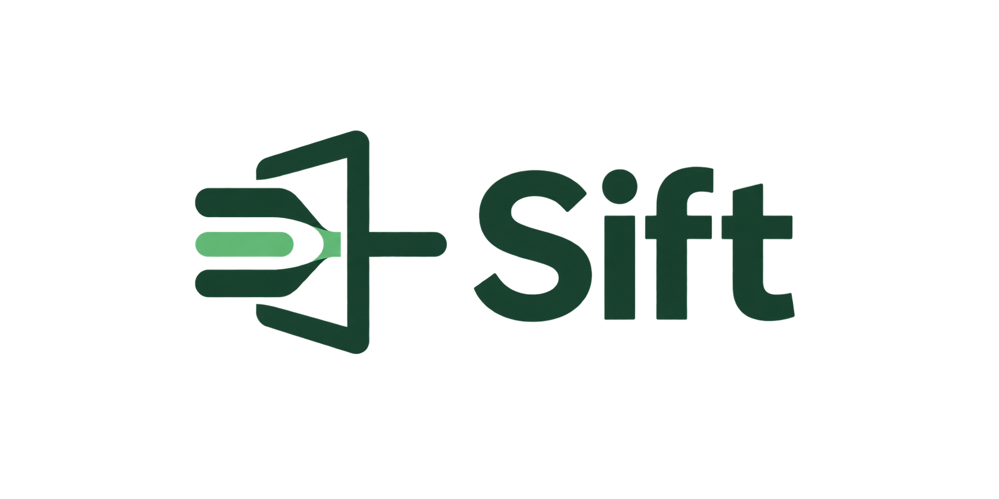
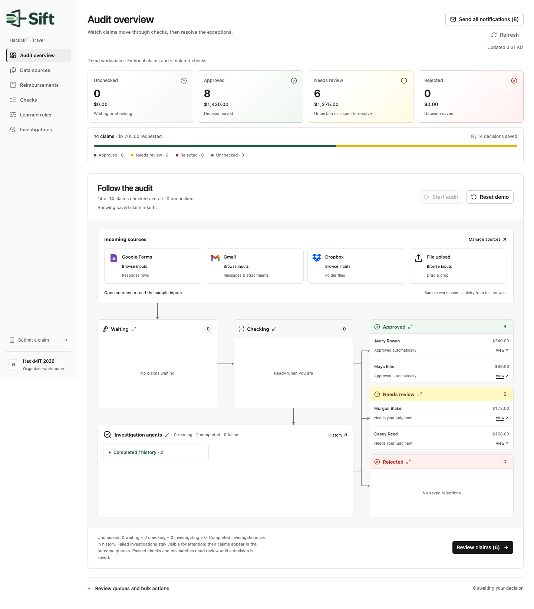
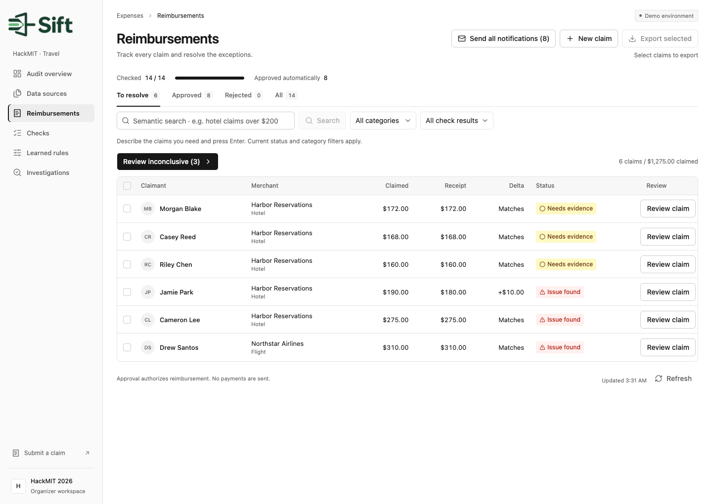
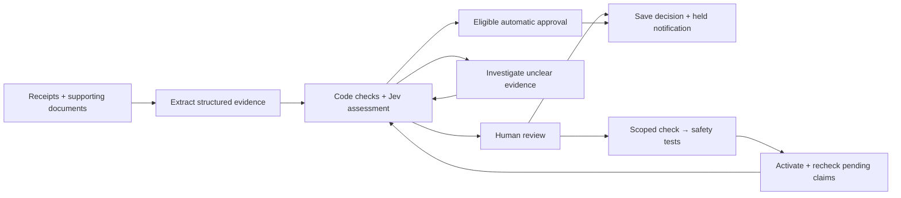

<div align="center">



# Sift

### Resolve the exception. Keep the lesson.

AI-assisted reimbursement review that turns human decisions into tested, reusable checks.

🏆 **HackMIT 2026 Finalist**


[Run locally](#-try-it-locally) · [How it works](#-how-it-works) · [Tech stack](#-tech-stack) · [Documentation](#-explore-the-repo)

</div>

---

Finance teams spend time reconciling receipts, chasing missing context, and resolving the same exceptions again. Sift brings the claim, its evidence, and the checks into one workspace: approve supported claims, investigate ambiguity, and put the remaining decisions in front of a reviewer.

Built at **HackMIT 2026**, motivated by **Maximor’s finance-workflow use case**.

## ✨ The workflow

| | What Sift does |
| --- | --- |
| 📥 **Bring in the paperwork** | Upload receipts and supporting documents; inspect extracted fields and suggested claim links before confirming them. |
| 🔎 **Check the evidence** | Validate amounts, currencies, dates, policy caps, identity, merchant names, and possible duplicates. |
| 🧭 **Investigate exceptions** | When useful supporting evidence exists, run a bounded investigation with recorded read tools and source citations. |
| 👤 **Keep reviewers in control** | Show the decisive facts, preserve human decisions, and prepare applicant notifications separately from private review notes. |
| 🧠 **Keep the lesson** | Turn a supported review reason into a scoped check, test it, and reuse it only when another claim supplies its own matching evidence. |

For example, a hotel receipt may use a billing descriptor that differs from the booking’s hotel name. Sift can connect the documents through their booking reference, guest, date, amount, and currency. A supported reviewer approval can teach that relationship without bypassing overclaim or duplicate checks.

## 🎬 Demo



*Current app, captured from the isolated 14-claim local showcase with simulated providers.*

<details>
<summary><strong>See the reimbursement workspace</strong></summary>



</details>

## ⚙️ How it works



One Next.js application handles the UI, API routes, and review services. **Code** enforces financial controls; **Jev** handles bounded semantic judgments and search; **Azure OpenAI** powers the investigation planner. Live mode stores records and private originals in **Supabase**. The local showcase uses private files and simulated providers.

Learning means **tested evidence-check reuse**, not model retraining. Saved human decisions survive rechecks. Approval records a decision; Sift does not move money.

## 🧰 Tech stack

| Layer | Tools |
| --- | --- |
| **App** |     |
| **UI** |     |
| **AI** |     |
| **Data & email** |     |
| **Testing** |    |
| **Built with** |    |

Devin contributed development, testing, and review support. The investigator inside Sift runs in the app; Devin is a development collaborator. The earlier [browser/voice prototype](docs/archive/browser-prototype.md) uses Grok voice and lives separately from the reimbursement app.

## 🚀 Try it locally

Requires **Node.js 22.18+** and npm. No API keys are needed for the local showcase.

```sh
git clone https://github.com/Cryplo/HackMIT26.git
cd HackMIT26/reconciliation
npm ci
NEXT_DIST_DIR=.next-showcase npm run demo -- --showcase --audit-ready --port 3002
```

Open **[127.0.0.1:3002/overview](http://127.0.0.1:3002/overview)** and choose **Start audit**. The launcher creates a fresh private dataset with 14 fictional claims and simulated providers. No real email is sent. **Reset demo** lets you replay the flow.

The cases cover ordinary claims, amount mismatches, policy-cap violations, duplicate and lookalike purchases, and matching, conflicting, or missing booking evidence. See the [showcase guide](reconciliation/docs/SHOWCASE.md) for the separate human-feedback learning rehearsal and [live setup](reconciliation/README.md#live-setup) for provider configuration.

One focused offline check:

```sh
node --conditions=react-server --import tsx scripts/check-showcase.ts
```
