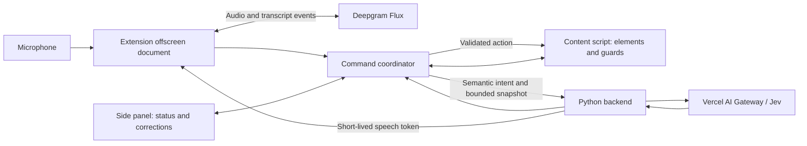

# Voice-controlled browser extension: implementation plan

Plan · September 19, 2026

Implementation update: the first extension/backend prototype is built. See
[setup and implementation boundaries](VOICE_EXTENSION.md) and
[validation evidence / remaining acceptance work](voice-demo-results.md).
Live Deepgram and intended-user trials remain pending.

## 1. Outcome and scope

Build a Chrome extension that lets a person navigate supported web pages and
complete forms through spoken commands. The first audience is people who have
difficulty using a mouse or keyboard and can comfortably use speech. Validate
this scope with intended users; do not claim support for speech impairments
without testing recognition and correction with those users.

The HackMIT demonstration is one complete workflow: open a form, identify fields
by meaning, dictate values, correct a mistake, review the result, and confirm
submission. Add simple media controls only after that workflow passes.

Supported MVP: English; one explicitly selected Chrome tab; visible main-frame
HTML controls; input, textarea, select, checkbox, radio, links, and buttons;
scrolling; numbered targets; direct dictation; cancel; safe field undo; voice
confirmation before submission. Installation, microphone permission, and site
permission require one-time setup, possibly with assistance. Promise hands-free
operation after setup, not hands-free installation.

Deferred: arbitrary autonomous multi-step tasks, Gmail and Google Docs editors,
gaming, canvas, cross-origin frames, closed shadow roots, uploads, password/payment
fields, purchases, browser-internal pages, offline speech recognition, and mobile.
Mercury-generated prose is a later increment; literal dictation needs no text LLM.

## 2. Architecture and reuse

Use Manifest V3, TypeScript, Vite, and a small React side panel. Add an asynchronous
FastAPI backend to the existing Python project, initially loopback-only on port
8767. Keep the existing inspector on 8766 as a regression tool.



The numbered-command fast path and dictation insertion remain inside the
extension after speech recognition. Semantic commands go through Jev. The backend
does not hold or operate the user's Chrome session.

| Existing component | Planned use |
| --- | --- |
| `jev_ultrafast/model.py` | Reuse Gateway request shape, response validation, and operation-specific targets; add an async transport with connection pooling. |
| `jev_ultrafast/questions.py` | Keep the autonomous-task prompt; add a separate single-utterance voice policy. |
| `jev_ultrafast/snapshot.js` | Port names, visibility rules, and target guards into a content-script module. |
| `jev_ultrafast/browser.py` | Keep Browser Use's CDP executor for existing demos and comparison tests. |
| `jev_ultrafast/agent.py` | Reuse consume-once and stale-state design; do not run its autonomous loop for every voice command. |
| Existing tests and fixtures | Preserve them; extend with voice-specific contracts and browser fixtures. |

The extension's default executor uses content scripts rather than Chrome remote
debugging. This avoids the recurring browser-connection approval flow. Browser Use
remains the existing reference executor, not an invisible dependency of every
extension action. If a site requires trusted native input that DOM events cannot
provide, report it unsupported in the MVP. Do not silently enable a debugger or
claim arbitrary-site compatibility.

## 3. Extension responsibilities

**Side panel:** microphone onboarding, selected-tab indicator, live transcript,
listening/processing status, pending action preview, ambiguity choices, pause,
error recovery, and optional spoken feedback. Expose controls through semantic
HTML, visible focus, non-color status cues, and a restrained live region. Keep a
typed-command input and keyboard-accessible controls as alternate paths.

**Offscreen document:** own the microphone stream, AudioContext, AudioWorklet,
and Deepgram WebSocket. Chrome service workers lack DOM access, so microphone
capture does not live there. Use the `USER_MEDIA` offscreen reason. Obtain
microphone consent in a visible extension page first; verify that permission
carries into the offscreen capture during the initial spike. [Chrome offscreen API](https://developer.chrome.com/docs/extensions/reference/api/offscreen)

**Service worker/coordinator:** route messages, associate work with the selected
tab, enforce command state, and request site permissions. Store recoverable
metadata in `chrome.storage.session`; never rely on worker globals surviving.
After a worker restart, reconcile with the offscreen document and content script,
discard unfinished decisions, and resume only from a known state. [Worker lifecycle](https://developer.chrome.com/docs/extensions/develop/concepts/service-workers/lifecycle)

**Content script:** observe the DOM, display overlays, retain element references,
validate guards, and execute a small code-defined action set. Keep node references
in the isolated extension world, not on a page-visible `window` property. Bundle
all executable code with the extension. [Content scripts](https://developer.chrome.com/docs/extensions/develop/concepts/content-scripts)

Initial permissions: `sidePanel`, `offscreen`, `storage`, `scripting`, and
`activeTab`; exact backend host permission; optional HTTP(S) site permissions
requested during setup. After the user grants a site's permission, register the
content script for that origin so navigation works without repeated gestures.
`activeTab` alone does not provide persistent access across arbitrary origins.
Unsupported pages must show a useful explanation instead of silently failing.

## 4. Speech pipeline

1. Backend exchanges its `DEEPGRAM_API_KEY` for a temporary browser credential.
   Extension opens the stream immediately using Deepgram's browser-supported
   authentication mechanism. Keep the permanent key exclusively server-side.
   Confirm token permissions and lifetime against the current API. [Deepgram authentication](https://developers.deepgram.com/guides/fundamentals/authenticating)
2. AudioWorklet captures mono audio, resamples to 16 kHz, and emits 16-bit PCM in
   approximately 40–80 ms chunks. Do not label browser-native 48 kHz samples as
   16 kHz. Use Flux's `/v2/listen` endpoint with `flux-general-en`, `linear16`, and
   the actual sample rate. [Flux quickstart](https://developers.deepgram.com/docs/flux/quickstart)
3. Partial transcripts update the panel but do not trigger page mutations.
4. Final turn events create a command. Deduplicate by session and turn ID.
5. On socket failure, cancel pending commands, show disconnected state, reconnect
   with bounded backoff and a new temporary token, and discard buffered old speech.
6. Closing listening releases audio tracks and the provider stream. Merely keeping
   an STT stream open may consume provider usage; do not equate silence with free.

Speculative Jev calls are a stretch feature. On `EagerEndOfTurn`, prepare a
decision; on `TurnResumed`, cancel it. Execute only if the final transcript and
page context still match. Cap speculative calls at one per turn initially.
[Deepgram eager-turn behavior](https://developers.deepgram.com/docs/flux/voice-agent-eager-eot)

Speech-based stop still depends on receiving a transcript. Recognize a standalone
stop phrase from partial transcripts to reduce delay, with dictation-mode rules
to avoid interpreting ordinary dictated text as commands. Do not claim offline
or acoustically instantaneous stopping. Keep an accessible local pause control.

## 5. Command routing and state

Explicit modes prevent accidental interpretation of dictated text:

| Mode | Examples | Processing |
| --- | --- | --- |
| Command | “Scroll down”, “click 12”, “go back” | Strict local grammar; only offered targets and supported actions. |
| Semantic command | “Focus the destination field”, “open the cancellation policy” | Jev chooses operation and target from the current snapshot. |
| Dictation | “Type: London”, then “finish dictation” | Final transcript inserts into the pinned field; no Mercury call. |
| Correction | “Undo last entry”, “clear this field” | Guarded local edit; destructive clearing gets a preview where needed. |
| Confirmation | “Confirm submit”, “cancel” | Match a currently pending action and its unchanged context. |

Only exact, well-defined phrases use the local path. Ambiguous language goes to
Jev or a clarification prompt. Do not guess a target from a partial name match.
Initially, “focus destination” followed by “type London” is sufficient; compound
commands can follow after reliable routing and transcript-span extraction exist.

Use states `OFF`, `LISTENING`, `DECIDING`, `CLARIFYING`, `DICTATING`,
`AWAITING_CONFIRMATION`, `EXECUTING`, and `ERROR`. Dictation has its own transcript
buffer. A new actionable command supersedes unfinished inference; never queue a
backlog of browser actions behind the user's speech. Stop increments a cancellation
generation and clears pending work. It cannot reverse an action already committed.

Each request carries:

```ts
type DecisionContext = {
  sessionId: string;
  turnId: string;
  generation: number;
  tabId: number;
  documentId: string;
  snapshotVersion: number;
  transcript: string;
  mode: "command" | "dictation";
};
```

Snapshot entries contain opaque element IDs, supported operations, accessible
names, current relevant state, and a compact guard. Coordinates remain local.
The result identifies an operation, observed target, operation/target confidence,
and probabilities. Extension execution returns `executed`, `stale`, `unsupported`,
or `failed`, with an action ID and verification result.

Maintain an execution ledger per document. Duplicate action IDs return the stored
result without another mutation. After navigation, tab changes, restart, or an
uncertain execution acknowledgement, discard the action and re-observe; do not
replay it. This is at-most-once behavior within a live document, not a promise of
exactly-once delivery across crashes.

## 6. DOM snapshots and execution

- Use stable node IDs for each document. Replaced nodes get new IDs. Number labels
  must not shuffle during an utterance; deleted targets become unavailable rather
  than having their numbers immediately reused.
- MutationObserver marks affected content dirty; input/change, scroll, resize,
  and navigation also invalidate relevant state. Refresh snapshots on demand with
  debouncing rather than continuously uploading every DOM mutation.
- Exclude overlay nodes from snapshots, so our own rendering never triggers a
  decision loop. Overlays should not intercept page clicks.
- Bound visible text and candidate count. Respect Jev's choice cardinality limit
  using a maximum of 200 targets per head initially, including select options.
  Report omitted candidates and offer scroll/refinement; do not silently present
  a truncated page as complete.
- Validate tab, document, generation, target identity, visibility, enabled state,
  relevant field values, and occlusion immediately before execution.
- Implement native input/textarea value setters plus input/change events, native
  select handling, focus, click, and scroll. Verify React-controlled input behavior
  in fixtures. Synthetic DOM events do not have `isTrusted`; use this as a tested
  compatibility boundary rather than assuming parity with CDP input.
- Verify each field mutation from a fresh read. Page navigation counts as pending
  until a new document or relevant result is observed. A Jev choice is not proof
  that the intended result happened.
- Undo restores the prior value only if the same field still contains the value
  this action wrote. Never promise general undo for navigation, sending, or submits.

For MVP forms, stage explicit submit actions for spoken confirmation. Bind the
confirmation to a digest of the target, form values, and document, with a short
expiry. Changes invalidate the confirmation. Semantic risk detection is not
perfect: start with known test workflows, block unsupported sensitive fields, and
do not claim every consequential custom widget can be identified automatically.

## 7. Backend and credentials

Add `hackmit serve` on loopback port 8767 with these routes:

| Route | Responsibility |
| --- | --- |
| `GET /health` | Report readiness and credential presence, never credential values. |
| `POST /v1/pair` | Exchange a single-use local pairing code for an extension session. |
| `POST /v1/speech/token` | Mint a short-lived Deepgram credential for an authenticated session. |
| `POST /v1/decide` | Validate bounded state; call Jev through Gateway; return a typed decision. |

Allow only the configured extension origin and authenticated pairing sessions;
validate Host, request size, schema, and rate limits. An extension origin is not
authentication by itself. Ordinary web pages must not be able to mint speech
tokens or spend Gateway credits. Keep the existing inspector's token checks.

Reuse `AI_GATEWAY_API_KEY`; add `DEEPGRAM_API_KEY`. Existing .env secrets remain
ignored. No permanent model key belongs in extension assets, page messages,
storage, or logs. Page content and transcripts are untrusted data. Send bounded
context, exclude sensitive input types, and redact values from default telemetry.
Visible page text can still contain personal information; explain cloud processing
in onboarding and allow site-level opt-out. No raw audio retention by our app.

Use async HTTP clients, a decision timeout, and explicit cancellation. Provider
retries may repeat inference but must not repeat execution. A late response cannot
cross the generation guard. Keep the local backend for the hackathon; hosting and
multi-user authentication are a separate deployment phase.

## 8. Latency, usage, and acceptance criteria

These are engineering targets to measure, not current product claims:

| Measurement | Initial target |
| --- | --- |
| Validated local command to DOM mutation acknowledgement | p95 under 100 ms on fixture pages |
| Final transcript received to semantic action acknowledgement | Median under 500 ms; p95 under 1 second |
| Acoustic speech end to visible result | Measure median/p95 separately; target median under 1 second, excluding page loading |
| Local pause activation to invalidation of pending work | Under 100 ms |

Record timestamps for audio capture, transcript receipt, turn completion, snapshot
read, model start/end, execution, and visible verification. Acoustic end requires
labeled test audio or aligned provider audio timing, not a guessed browser clock.
Report cold start separately and avoid subtracting clocks across machines.

Track attempted and successful model calls, token usage, reported cost versus
estimated cost, and speech-session duration. Add configurable per-session request
and listening limits. Failed/retried/speculative requests count toward limits.
Provider dashboards remain authoritative for billing; pausing closes speech
streaming while preserving the UI. If the microphone is fully stopped, resuming
requires a local accessible control; a wake phrase cannot work without a listener.

## 9. Delivery sequence

| Phase | Work | Exit criterion |
| --- | --- | --- |
| 0. Compatibility spike | Load unpacked extension; request microphone; test offscreen PCM; observe and edit native/React fixture fields. | Audio survives panel closure; values and events behave correctly; permission flow documented. |
| 1. Typed command slice | Content observer/executor, side panel, pairing backend, Jev endpoint, action IDs and guards. | Typed semantic commands and numbered clicks work without Chrome remote debugging. |
| 2. Voice slice | Deepgram stream, final-turn deduplication, command/dictation modes, direct text insertion. | Voice-only form completion after setup; no Mercury needed for literals. |
| 3. Recovery and accessibility | Stop, ambiguity choices, field undo, confirmation, permission/network errors, worker recovery. | No stale or duplicate mutation in failure tests; every supported recovery has a hands-free path while connected. |
| 4. Evidence and demo | Instrument latency/usage, run scripted trials, try with intended users, record demonstration. | Verified workflow and measured latency report; limitations documented. |
| Stretch | Media commands, speculative Jev, optional Mercury composition, additional sites. | Each feature earns its own compatibility and correctness tests. |

Budget the core as roughly two focused hackathon days for a small team, with the
compatibility spike first. If behind, cut speculation, generated prose, and media
before cutting error recovery or outcome verification. Do not depend on live
Google Flights as the only demo; retain a deterministic form fixture and a second
tested public site.

## 10. Test plan and completion gate

Python tests cover Gateway contracts, budgets, cancellation, authentication,
temporary-token issuance failures, and invalid model output. TypeScript tests
cover local grammar, dictation separation, duplicate turns, confirmation expiry,
and document/generation guards. Browser tests use Chromium with the built extension
and a deterministic transcript adapter. These do not replace real-microphone tests.

Regression fixtures include replaced nodes, occluding overlays, disabled fields,
React-controlled forms, ambiguous labels, rerendered forms, SPA navigation,
permission revocation, worker restart, backend restart, late model responses,
network loss, and disconnect after execution but before acknowledgement. Fake
provider tests run in CI without API credentials; live tests are opt-in.

Before demo completion: pass at least 18 of 20 predefined form trials on the
supported fixtures; make zero duplicate submissions in adversarial tests; block
every stale pending action in the test matrix; show actionable states for missing
permissions and network loss; publish actual latency and cost measurements.
These are prototype acceptance targets, not evidence of population-wide
accessibility or arbitrary-web reliability. Seek feedback from intended users on
command discoverability, fatigue, corrections, and feedback timing.

## 11. Proposed files and required inputs

```text
extension/
  manifest.json
  src/background.ts
  src/offscreen/{audio.ts,pcm-worklet.ts,deepgram.ts}
  src/content/{snapshot.ts,overlay.ts,executor.ts}
  src/voice/{router.ts,state-machine.ts,dictation.ts}
  src/shared/protocol.ts
  src/panel/
hackmit26/server/{app.py,auth.py,speech.py,decisions.py,schemas.py}
tests/                         # Python contracts and retained regression suite
extension/tests/               # Unit and browser integration tests
docs/voice-demo-results.md      # Measured results, environment, and limitations
```

Required before live speech implementation: a Deepgram key saved locally, Chrome
microphone permission, and a selected test microphone. Begin with the existing
travel fixture plus a dedicated registration form containing validation and a
review step. A willing intended-user tester would improve the design, but is not
a prerequisite for building the technical prototype. Keep the existing CLI and
Google Flights demo functional while the extension is built.
